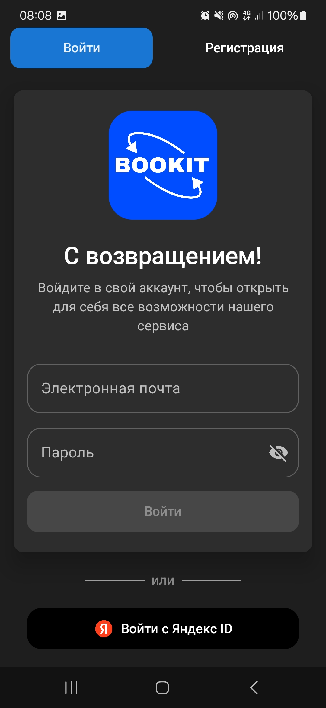
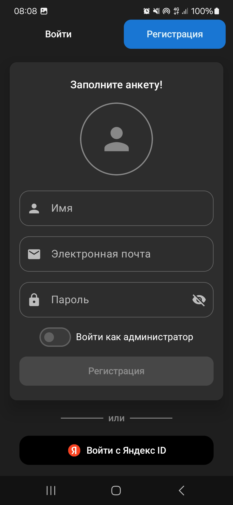
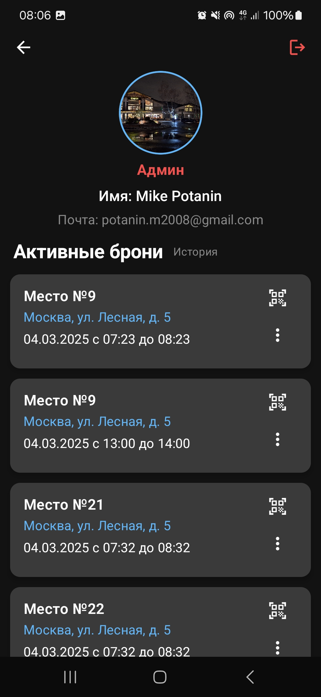
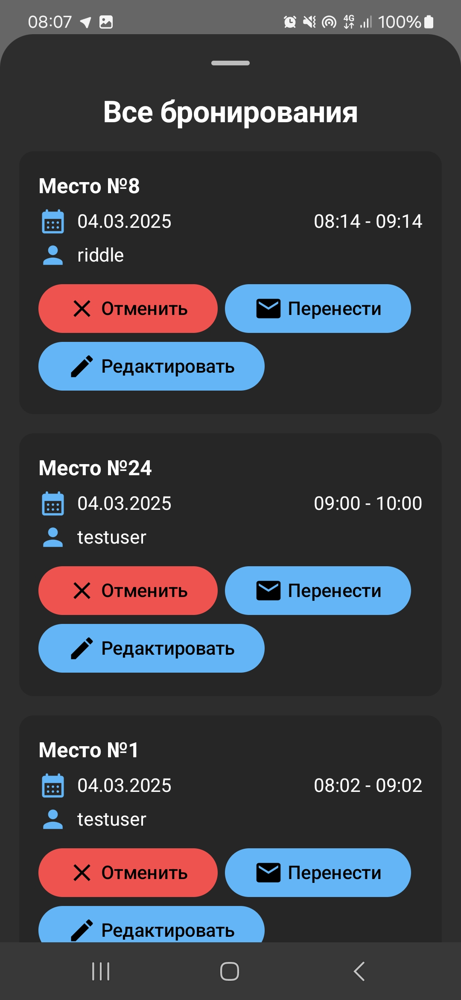
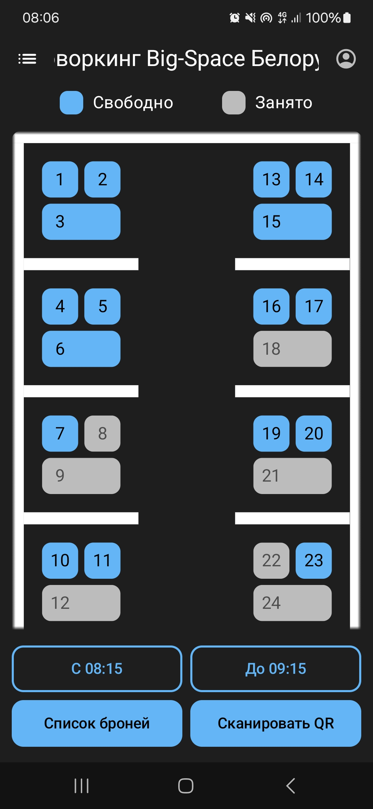
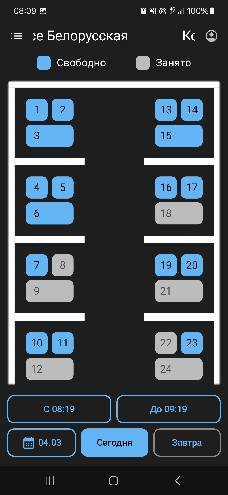
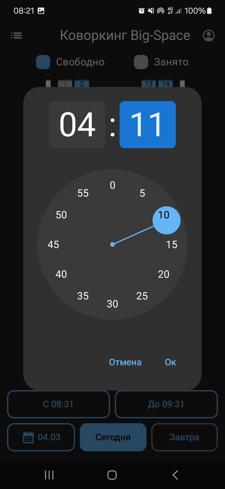
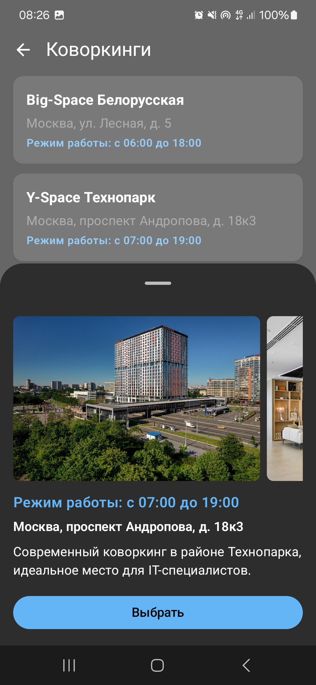
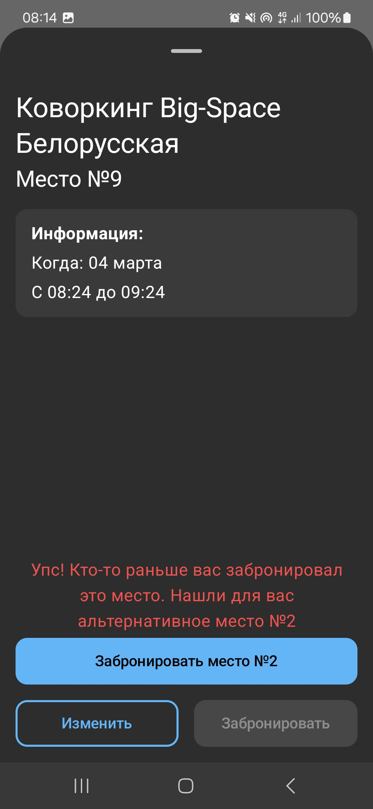

# BookIT

BookIT — современное Android-приложение для бронирования коворкингов. Разработанное с использованием Jetpack Compose и следуя современным практикам разработки под Android, это приложение позволяет пользователям легко находить и бронировать доступные места в коворкингах.

## Возможности

- **Аутентификация пользователей**: Вход с помощью email/пароля или Яндекс ID
- **Навигация по коворкингам**: Просмотр различных коворкингов
- **Доступность в реальном времени**: Отображение свободных мест в реальном времени
- **Сканирование QR-кодов**: Быстрое бронирование с помощью сканирования QR-кода
- **Управление бронированиями**: Просмотр, изменение и отмена бронирований
- **Профили пользователей**: Управление личной информацией и историей бронирований
- **Интерфейс администратора**: Специальные функции для администраторов коворкингов

## Технологии

- **UI**: Jetpack Compose с дизайном Material 3
- **Архитектура**: Чистая архитектура с паттерном MVVM
- **Внедрение зависимостей**: Koin
- **Сетевое взаимодействие**: Retrofit с OkHttp
- **Загрузка изображений**: Coil
- **База данных**: Room для локального хранения
- **Аутентификация**: Собственная аутентификация с интеграцией Яндекс OAuth
- **QR-код**: ZXing и ML Kit для сканирования штрих-кодов
- **Push-уведомления**: Firebase Cloud Messaging

## Скриншоты

    
    
    

    
    
    

    
    
    

## Системные требования

- Android 8.0 (уровень API 26) или выше
- Gradle 8.0+
- Kotlin 2.1

## Структура проекта

Приложение следует принципам Чистой архитектуры со следующими модулями:

- **presentation**: UI-компоненты, ViewModels и модели состояния UI
- **domain**: Бизнес-логика
- **data**: Репозитории, источники данных и API-клиенты
- **common**: Общие утилиты и расширения
